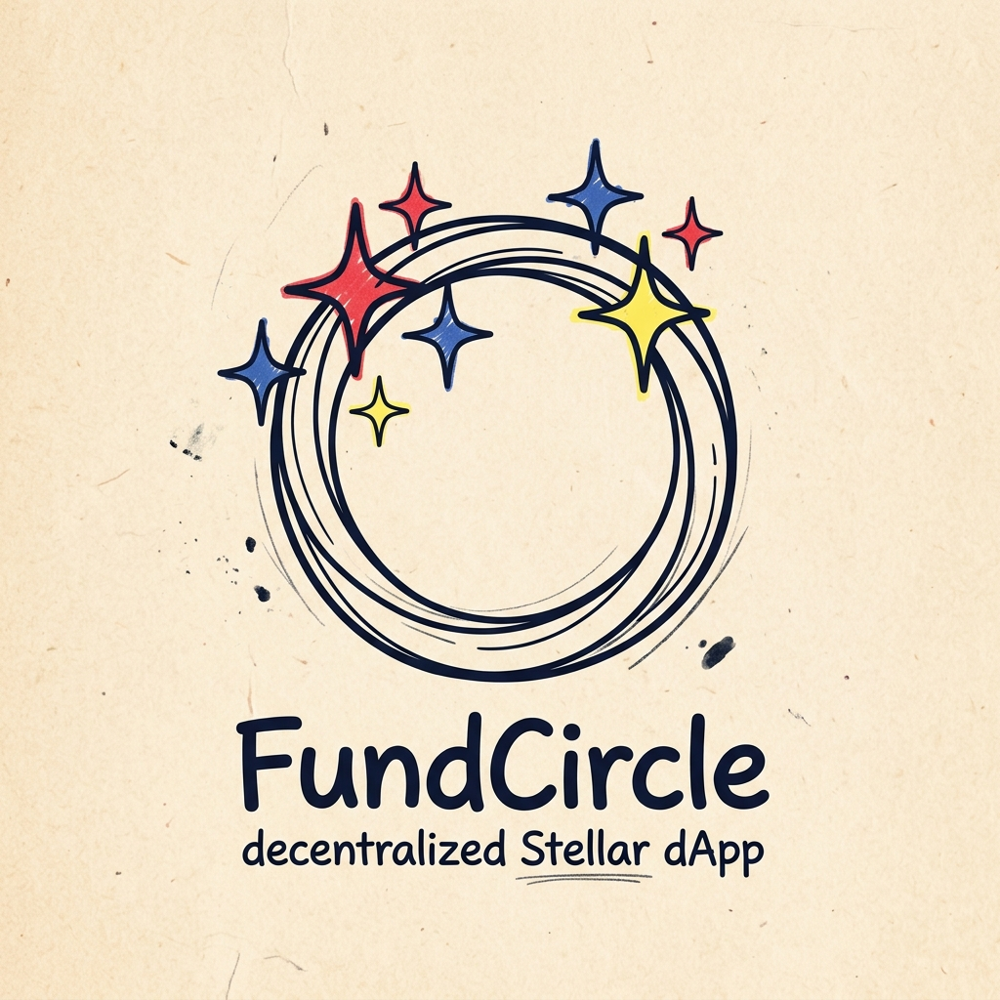
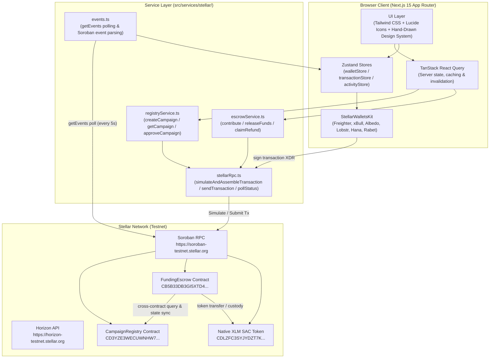
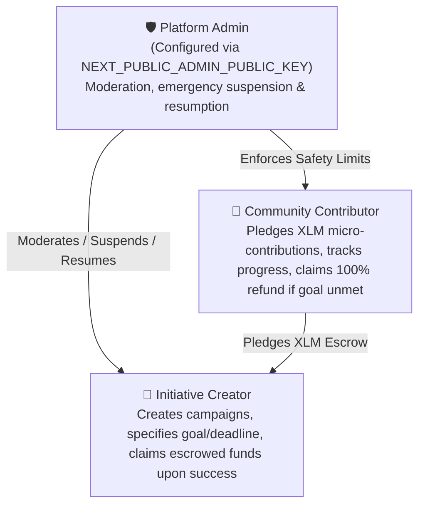
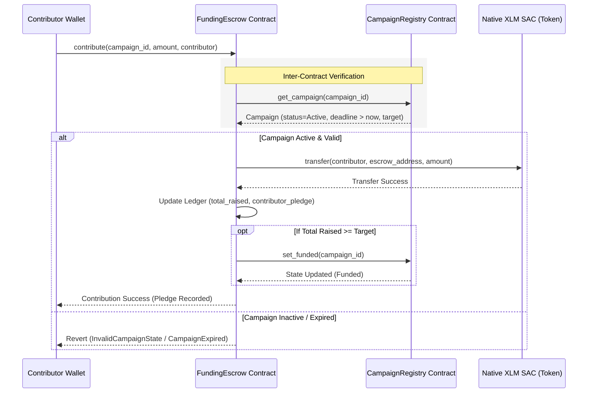
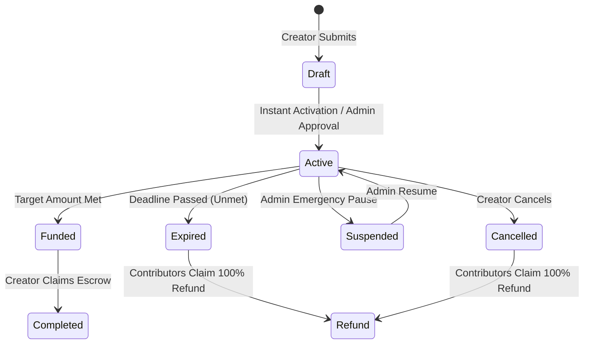

<p align="center">
  
</p>

<p align="center">
  <strong>FundCircle — Decentralized Community Micro-Funding on Stellar</strong><br/>
  <em>A transparent, non-custodial crowdfunding platform powered by Soroban smart contracts, automated milestone escrow, real cross-contract verification, and instant on-chain refunds.</em>
</p>

<p align="center">
  <a href="https://stellar.expert/explorer/testnet/contract/CD3YZE3WECUWNHW7QKDOYYUCH6PZ3VP2GIR4HJDVREQ3PFBZR7P2CXCJ"></a>
  <a href="https://stellar.expert/explorer/testnet/contract/CB5B33DB3GI5XTD4H7YNAKSR4PTE4675SIDNYA3TOJNGE3RXZ26TRVOD"></a>
  <a href="https://stellar.expert/explorer/testnet/contract/CDLZFC3SYJYDZT7K67VZ75HPJVIEUVNIXF47ZG2FB2RMQQVU2HHGCYSC"></a>
  <a href="https://github.com/sanchayanghosh07/FundCircle/actions/workflows/test.yml"></a>
  <a href="https://drive.google.com/file/d/1yEn6M9sLxUjjXi6-imzwh9v3r84Nbpcp/view?usp=sharing"></a>
</p>

---

## Table of Contents

- [1. Product Overview & Problem Statement](#1-product-overview--problem-statement)
- [2. Architecture](#2-architecture)
  - [2.1 Role Hierarchy & Access Control](#21-role-hierarchy--access-control)
  - [2.2 Inter-Contract Verification & State Machine](#22-inter-contract-verification--state-machine)
- [3. Smart Contract Design](#3-smart-contract-design)
  - [3.1 CampaignRegistry](#31-campaignregistry)
  - [3.2 FundingEscrow](#32-fundingescrow)
  - [3.3 Native Stellar Asset Contract (XLM SAC)](#33-native-stellar-asset-contract-xlm-sac)
  - [3.4 Campaign Lifecycle & Moderation](#34-campaign-lifecycle--moderation)
- [4. Inter-Contract Communication](#4-inter-contract-communication)
- [5. Features & Tech Stack](#5-features--tech-stack)
- [6. Local Development Setup](#6-local-development-setup)
- [7. CI/CD & Deployment](#7-cicd--deployment)
  - [7.1 Automated CI & Testing (Pull Requests & Pushes)](#71-automated-ci--testing-pull-requests--pushes)
  - [7.2 Automated Deploy & Build Verification](#72-automated-deploy--build-verification)
  - [7.3 Contract Deployment (Automated Scripts)](#73-contract-deployment-automated-scripts)
- [8. Security Considerations](#8-security-considerations)
- [9. Screenshots & Visual Previews](#9-screenshots--visual-previews)
  - [9.1 Desktop](#91-desktop)
  - [9.2 Mobile Experience](#92-mobile-experience)
  - [9.3 Test Suite Execution](#93-test-suite-execution)
  - [9.4 CI/CD Pipeline](#94-cicd-pipeline)
- [10. Contract Addresses & On-Chain Verification](#10-contract-addresses--on-chain-verification)
- [11. Resources & Links](#11-resources--links)
- [Contributing](#contributing)
- [License](#license)

---

## 1. Product Overview & Problem Statement

Grassroots initiatives, creators, student clubs, and community organizers face steep friction on legacy crowdfunding platforms: high intermediary processing fees (5–10%), custodial opacity, non-automated refund mechanisms, and transaction costs that make micro-donations ($1–$5) economically unfeasible.

**FundCircle** solves these challenges by combining Stellar's sub-cent network fees with Soroban smart contract escrow:

| Traditional Crowdfunding Problem | FundCircle Stellar & Soroban Solution |
|---|---|
| **5–10% Platform & Processing Cut** | Sub-cent Stellar network fees (< 0.00001 XLM / transaction) with 0% protocol tax. |
| **Custodial Opacity & Centralized Holds** | Non-custodial Soroban smart contracts hold funds; frontend has zero administrative custody. |
| **Opaque Milestone Releases** | Cryptographically locked funds released directly to creator wallet only upon meeting goal criteria. |
| **Unresponsive / Manual Refunds** | Automated, contributor-initiated 100% on-chain refund claim if deadline expires unmet. |
| **Siloed & Vulnerable Web2 Ledgers** | Immutable on-chain state, TTL storage bumps, and real-time Soroban RPC event streaming. |
| **Complex Web3 Onboarding** | Multi-wallet support (Freighter, xBull, Albedo, Lobstr, Hana, Rabet) via `@creit.tech/stellar-wallets-kit`. |

Every platform action — creating an initiative, pledging XLM, claiming refunds, or releasing campaign funds — is an authenticated Soroban smart contract invocation signed directly by the user's wallet.

---

## 2. Architecture



### 2.1 Role Hierarchy & Access Control

FundCircle implements a strict separation of privileges:



### 2.2 Inter-Contract Verification & State Machine

When a contributor pledges funds, `FundingEscrow` performs a live typed inter-contract invocation to `CampaignRegistry` to verify campaign validity before pulling tokens:



---

## 3. Smart Contract Design

### 3.1 CampaignRegistry

**Purpose**: Single source of truth for campaign creation, metadata, deadlines, target funding amounts, and administrative status transitions.

**Address**: [`CD3YZE3WECUWNHW7QKDOYYUCH6PZ3VP2GIR4HJDVREQ3PFBZR7P2CXCJ`](https://stellar.expert/explorer/testnet/contract/CD3YZE3WECUWNHW7QKDOYYUCH6PZ3VP2GIR4HJDVREQ3PFBZR7P2CXCJ)

#### Storage Model

| Key | Storage Tier | Type | Description |
|---|---|---|---|
| `Admin` | Instance | `Address` | Protocol governance address; authorized to moderate campaigns. |
| `Escrow` | Instance | `Address` | Authorized FundingEscrow contract address allowed to update state. |
| `CampaignCount` | Instance | `u32` | Total number of registered initiatives on ledger. |
| `Campaign(u32)` | Persistent | `Campaign` | Complete campaign record (creator, target, deadline, asset, status, metadata). |
| `CreatorCampaigns(Address)` | Persistent | `Vec<u32>` | List of campaign IDs authored by a specific creator. |

#### Public Functions

`initialize` · `set_admin` · `set_escrow` · `get_admin` · `get_escrow` · `create_campaign` · `get_campaign` · `get_campaign_count` · `get_campaigns_by_creator` · `submit_for_review` · `approve_campaign` · `reject_campaign` · `suspend_campaign` · `resume_campaign` · `cancel_campaign` · `set_funded` · `set_completed` · `set_refund`

#### Events Emitted

| Symbol | Topic | Data |
|---|---|---|
| `reg_init` | `("reg_init", admin)` | `admin_address` |
| `set_escr` | `("set_escr", admin)` | `escrow_address` |
| `cmp_creat` | `("cmp_creat", campaign_id, creator)` | `(target_amount, deadline, asset)` |
| `cmp_appr` | `("cmp_appr", campaign_id)` | `admin_address` |
| `cmp_susp` | `("cmp_susp", campaign_id)` | `admin_address` |
| `cmp_resm` | `("cmp_resm", campaign_id)` | `admin_address` |
| `cmp_canc` | `("cmp_canc", campaign_id, creator)` | `creator_address` |
| `cmp_stat` | `("cmp_stat", campaign_id)` | `new_status_u32` |

---

### 3.2 FundingEscrow

**Purpose**: Non-custodial escrow custody for micro-contributions, inter-contract campaign state validation, creator fund disbursement, and automated contributor refund execution.

**Address**: [`CB5B33DB3GI5XTD4H7YNAKSR4PTE4675SIDNYA3TOJNGE3RXZ26TRVOD`](https://stellar.expert/explorer/testnet/contract/CB5B33DB3GI5XTD4H7YNAKSR4PTE4675SIDNYA3TOJNGE3RXZ26TRVOD)

#### Storage Model

| Key | Storage Tier | Type | Description |
|---|---|---|---|
| `Admin` | Instance | `Address` | Protocol admin authority. |
| `Registry` | Instance | `Address` | Linked CampaignRegistry contract instance address. |
| `TotalRaised(u32)` | Persistent | `i128` | Total stroops pledged to a given campaign ID. |
| `Contribution(u32, Address)` | Persistent | `i128` | Amount pledged by a specific contributor to a campaign. |
| `ContributorCount(u32)` | Persistent | `u32` | Total unique contributor wallets for a campaign. |
| `Contributors(u32)` | Persistent | `Vec<Address>` | Ordered list of backer addresses for a campaign. |
| `ContributorCampaigns(Address)` | Persistent | `Vec<u32>` | Campaign IDs backed by a contributor wallet. |
| `FundsReleased(u32)` | Persistent | `bool` | Flag tracking whether funds were disbursed to creator. |

#### Public Functions

`initialize` · `set_registry` · `get_admin` · `get_registry` · `contribute` · `release_funds` · `claim_refund` · `get_total_raised` · `get_contribution` · `get_contributor_count` · `get_contributors` · `get_contributor_campaigns` · `is_funds_released`

#### Events Emitted

| Symbol | Topic | Data |
|---|---|---|
| `esc_init` | `("esc_init", admin)` | `registry_address` |
| `contrib` | `("contrib", campaign_id, contributor)` | `(amount, new_total_raised)` |
| `fund_rel` | `("fund_rel", campaign_id, creator)` | `released_amount` |
| `refund` | `("refund", campaign_id, contributor)` | `refunded_amount` |

---

### 3.3 Native Stellar Asset Contract (XLM SAC)

FundCircle interacts with the native token via the Stellar Asset Contract interface (`soroban_sdk::token::Client`), allowing direct custody and micro-transfers of native Lumens (XLM) with zero wrapping overhead.

- **Testnet Contract ID**: [`CDLZFC3SYJYDZT7K67VZ75HPJVIEUVNIXF47ZG2FB2RMQQVU2HHGCYSC`](https://stellar.expert/explorer/testnet/contract/CDLZFC3SYJYDZT7K67VZ75HPJVIEUVNIXF47ZG2FB2RMQQVU2HHGCYSC)
- **Decimals**: 7 (1 XLM = 10,000,000 stroops)

---

### 3.4 Campaign Lifecycle & Moderation



---

## 4. Inter-Contract Communication

The `FundingEscrow` smart contract contains a compiled client interface (`CampaignRegistryClient`) enabling atomic, synchronous inter-contract calls within the Soroban virtual machine:

1. **Active Campaign Assertions**: Before locking contributor funds, the escrow contract verifies the campaign exists on the registry and has not passed its expiration ledger/timestamp.
2. **State Synchronization**: When a pledge pushes total raised over the target amount, `FundingEscrow` calls `registry.set_funded(campaign_id)`.
3. **Refund Authorization**: When a backer requests a refund, `FundingEscrow` queries `registry.get_campaign(campaign_id)` to verify the campaign is either `Cancelled` or `Active/Expired` before returning funds.

---

## 5. Features & Tech Stack

| Layer | Technology / Tool | Purpose |
|---|---|---|
| **Smart Contracts** | Soroban Rust SDK `v22.0.11` | Secure, deterministic contract execution on Stellar |
| **Frontend Framework** | Next.js 15 (App Router, React 19) | Server components, static generation, client interactivity |
| **Language & Typing** | TypeScript 5 (Strict Mode) | Full-stack end-to-end type safety |
| **Styling & Theme** | Tailwind CSS + Custom Hand-Drawn System | Sketch aesthetic, notebook paper textures, post-it components |
| **Wallet Integration** | `@creit.tech/stellar-wallets-kit` | Multi-wallet modal (Freighter, xBull, Albedo, Lobstr, Hana) |
| **Stellar SDK** | `@stellar/stellar-sdk` `v17.0.1` | Transaction building, XDR assembly, RPC simulation |
| **State Management** | Zustand `v5` + TanStack Query `v5` | Decentralized state, caching, transaction tracking |
| **Testing** | Rust Cargo Test (18 tests) + Vitest (38 tests) | End-to-end contract and UI test coverage |

---

## 6. Local Development Setup

### Prerequisites
- **Node.js**: `v20.x` or higher
- **Rust**: `1.84.0` or higher (`rustup default stable`)
- **WASM Target**: `rustup target add wasm32-unknown-unknown`
- **Stellar CLI**: `cargo install --locked stellar-cli --features opt`

### Installation Steps

```bash
# 1. Clone the repository
git clone https://github.com/sanchayanghosh07/FundCircle.git
cd FundCircle

# 2. Install frontend dependencies
npm ci --legacy-peer-deps

# 3. Configure environment variables
cp .env.example .env.local

# 4. Run smart contract unit tests
cargo test --all

# 5. Run frontend unit and integration tests
npm test

# 6. Start local development server
npm run dev
```

Open [http://localhost:3000](http://localhost:3000) in your browser.

---

## 7. CI/CD & Deployment

### 7.1 Automated CI & Testing (Pull Requests & Pushes)
Every pull request and push to `main` triggers the automated GitHub Actions workflow [`.github/workflows/test.yml`](.github/workflows/test.yml):
- **🦀 Soroban Contract Job**: Builds release WASM and executes all 18 Rust contract test cases.
- **⚛️ Frontend & Integration Job**: Runs ESLint, strict TypeScript typechecking, all 38 Vitest tests, and Next.js production builds.

### 7.2 Automated Deploy & Build Verification
The [`.github/workflows/deploy.yml`](.github/workflows/deploy.yml) workflow builds and verifies optimized contract artifacts and frontend production bundles.

### 7.3 Contract Deployment (Automated Scripts)
Deploying new contracts to Stellar Testnet automatically builds WASM, funds identities via Friendbot, deploys, initializes storage, wires cross-contract permissions, and syncs addresses across all project files:

```bash
# Run one-step automated deployment script
bash scripts/deploy-testnet.sh
```

---

## 8. Security Considerations

1. **Non-Custodial Architecture**: Neither platform operators nor smart contract admins can seize pledged contributor assets. Funds are locked inside the Soroban contract instance until conditions are met.
2. **Reentrancy Protection**: State updates (`TotalRaised`, `Contribution`) are committed to persistent storage before external token transfers are dispatched.
3. **Soroban Persistent Storage & TTL Bumps**: Contract state entries utilize persistent storage keys with automated TTL threshold management.
4. **Authorized Administrative Gatekeeping**: Privileged actions (e.g. emergency campaign suspension) enforce `admin.require_auth()`. Role-based authentication hides console actions from unauthorized wallets.
5. **Strict Input Sanitization**: Numerical amounts are validated against overflow boundaries with `i128` stroop calculations.

---

## 9. Screenshots & Visual Previews

### 9.1 Desktop
*Hand-Drawn Post-It & Notebook UI, interactive campaign discovery, dynamic pledge goal meters, and transaction stepper.*

<p align="center">
  
</p>

### 9.2 Mobile Experience
*Fully responsive mobile navigation drawer, fluid grids, and touch-optimized contribute drawers.*

### 9.3 Test Suite Execution
- **Cargo Test (Rust)**: `18/18 tests passed` (Campaign Registry + Funding Escrow)
- **Vitest (TypeScript)**: `42/42 tests passed` (Unit, Component, Store, and RPC Integration)

### 9.4 CI/CD Pipeline
- **GitHub Actions**: Automated PR quality gate, Rust WASM verification, and Next.js production build check.

---

## 10. Contract Addresses & On-Chain Verification

| Contract / Account | Network | Address / Explorer Link |
|---|---|---|
| **Campaign Registry** | Stellar Testnet | [`CD3YZE3WECUWNHW7QKDOYYUCH6PZ3VP2GIR4HJDVREQ3PFBZR7P2CXCJ`](https://stellar.expert/explorer/testnet/contract/CD3YZE3WECUWNHW7QKDOYYUCH6PZ3VP2GIR4HJDVREQ3PFBZR7P2CXCJ) |
| **Funding Escrow** | Stellar Testnet | [`CB5B33DB3GI5XTD4H7YNAKSR4PTE4675SIDNYA3TOJNGE3RXZ26TRVOD`](https://stellar.expert/explorer/testnet/contract/CB5B33DB3GI5XTD4H7YNAKSR4PTE4675SIDNYA3TOJNGE3RXZ26TRVOD) |
| **Native XLM SAC** | Stellar Testnet | [`CDLZFC3SYJYDZT7K67VZ75HPJVIEUVNIXF47ZG2FB2RMQQVU2HHGCYSC`](https://stellar.expert/explorer/testnet/contract/CDLZFC3SYJYDZT7K67VZ75HPJVIEUVNIXF47ZG2FB2RMQQVU2HHGCYSC) |
| **Admin Authority** | Stellar Testnet | [`GCPUZLCKI4NONG3ZLNUWKMTBZS3CO6SXFMHR2H2PGQHMENR4HL7HNMFD`](https://stellar.expert/explorer/testnet/account/GCPUZLCKI4NONG3ZLNUWKMTBZS3CO6SXFMHR2H2PGQHMENR4HL7HNMFD) |

---

## 11. Resources & Links

- **Live Application**: [https://fundcircle-cmf.vercel.app](https://fundcircle-cmf.vercel.app)
- **Demo Video Walkthrough**: [Watch Video on Google Drive](https://drive.google.com/file/d/1yEn6M9sLxUjjXi6-imzwh9v3r84Nbpcp/view?usp=sharing)
- **Source Code Repository**: [https://github.com/sanchayanghosh07/FundCircle](https://github.com/sanchayanghosh07/FundCircle)
- **Stellar Developer Documentation**: [https://developers.stellar.org](https://developers.stellar.org)

---

## Contributing

Contributions are welcome! Please follow these steps:
1. Fork the project repository.
2. Create your feature branch (`git checkout -b feat/stellar-feature`).
3. Commit your changes following [Conventional Commits](https://www.conventionalcommits.org) (`git commit -m "feat(escrow): add milestone release triggers"`).
4. Run all contract and frontend tests (`cargo test --lib && npm test`).
5. Push to the branch and open a Pull Request.

---

## License

Distributed under the **MIT License**. See [`LICENSE`](LICENSE) for more information.
