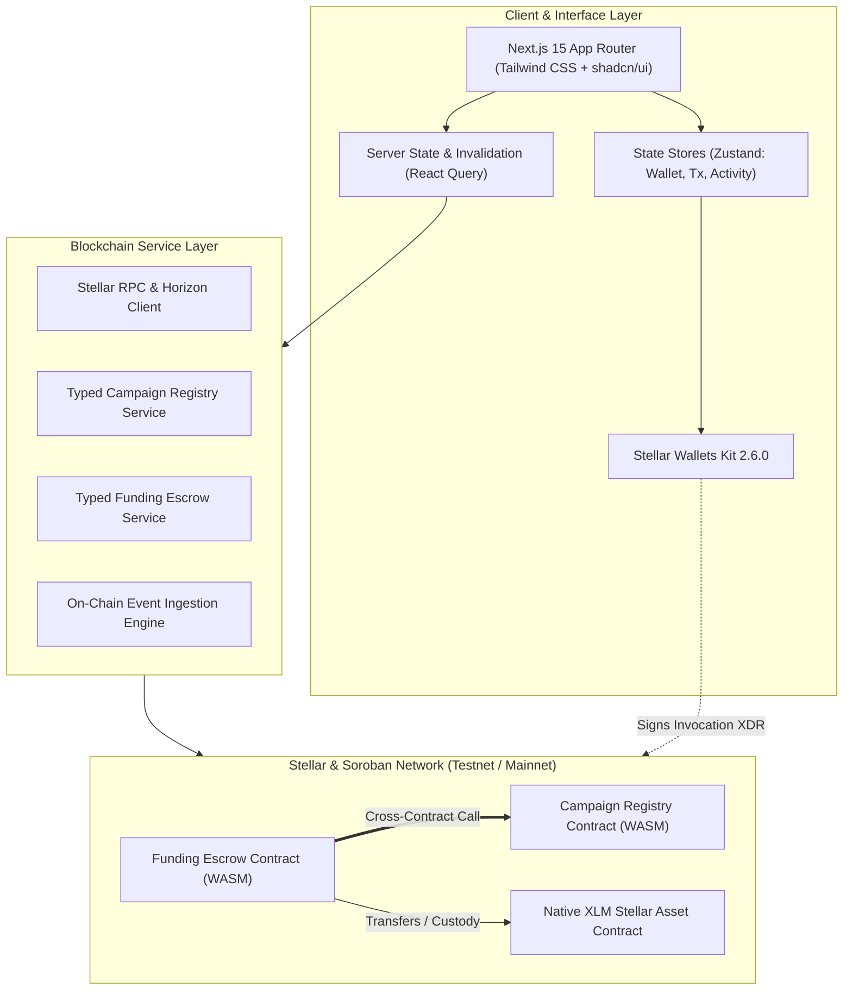
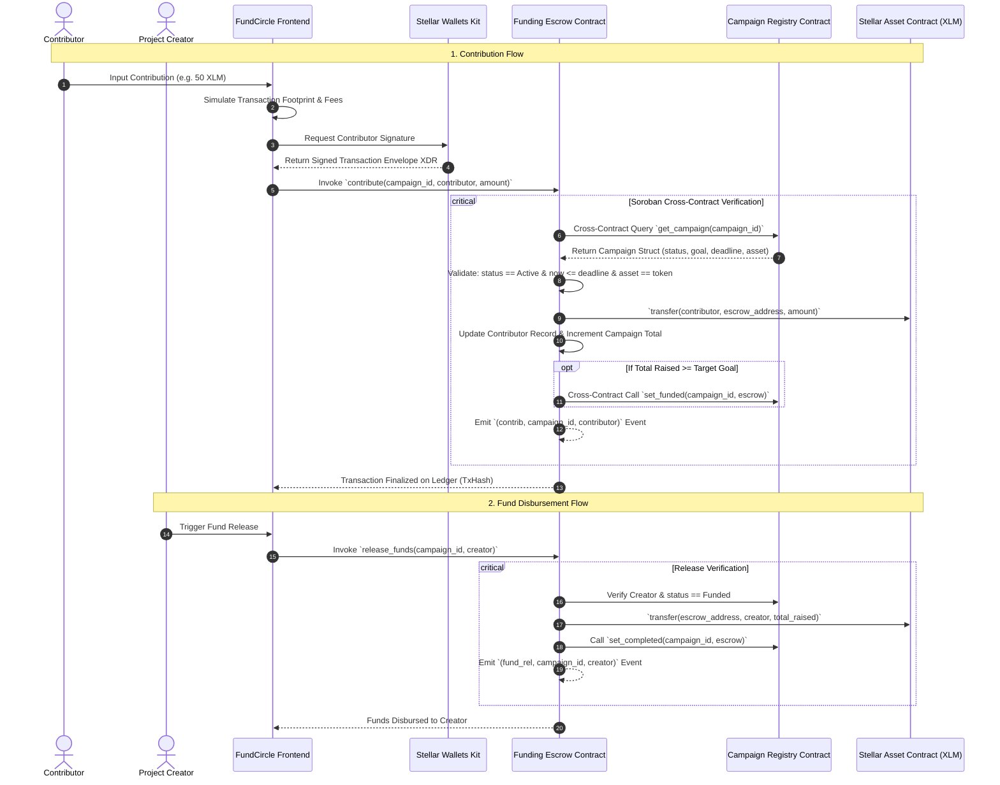
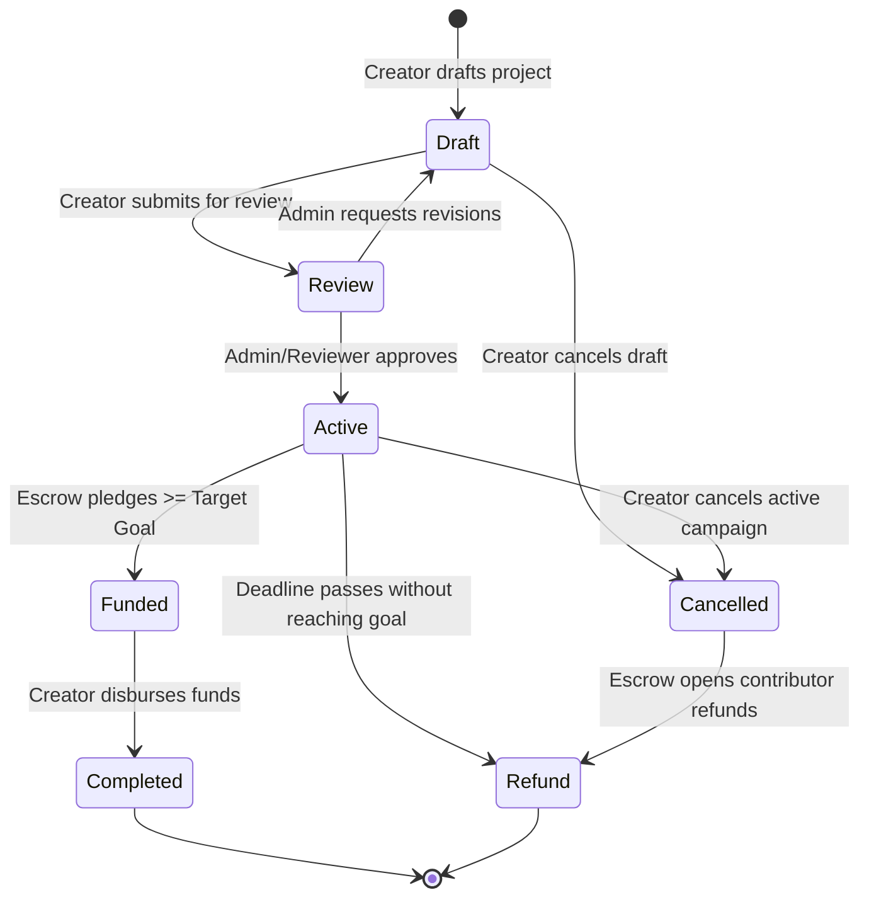

# FundCircle — Community Micro-Funding Platform on Stellar

[](https://github.com/sanchayanghosh07/FundCircle/actions)
[-14b8a6?style=flat&logo=stellar)](https://stellar.org)
[](https://developers.stellar.org)
[](https://nextjs.org)
[](https://opensource.org/licenses/MIT)

> **Production-grade, non-custodial community micro-funding platform powered by Stellar and Soroban smart contracts.**

FundCircle enables communities, grassroots organizers, university clubs, and public initiatives to pool transparent micro-contributions with automated smart contract custody, genuine cross-contract validation, and 100% on-chain refund protection.

---

## 1. Problem Statement & Solution

### The Problem with Traditional Micro-Funding
- **Excessive Intermediary Fees**: Legacy crowdfunding platforms extract 5–10% in processing and platform cuts, penalizing grassroots initiatives.
- **Custodial Opacity**: Contributed funds sit in centralized bank accounts with zero cryptographic guarantee of milestone execution, creator identity verification, or automated refund protection.
- **Economic Inviability of Micro-Donations**: Credit card interchange fees ($0.30 + 2.9%) make true micro-contributions ($1 to $5) completely unviable.

### The FundCircle Solution
- **Ultra-Low Micro-Fees on Stellar**: Average transaction fee is **< 0.00001 XLM** (< $0.0001) with sub-5-second finality.
- **Non-Custodial Soroban Smart Escrow**: Funds are locked inside the Soroban contract instance. The frontend has zero custody or administrative access to user assets.
- **Real Cross-Contract Invocations**: The `FundingEscrow` contract performs live, typed contract-to-contract queries to the `CampaignRegistry` before accepting pledges.
- **Guaranteed On-Chain Refunds**: If a campaign expires unmet or is cancelled, contributors can claim an instant, direct 100% refund from the smart contract.

---

## 2. Why Stellar & Soroban

1. **Deterministic Execution & State Isolation**: Soroban smart contracts provide strong isolation, state boundaries, and TTL-based persistent ledger storage.
2. **Native Token Standard (SAC)**: Integrates directly with Stellar Asset Contracts (`soroban_sdk::token::Client`), allowing custody of native XLM and any issued asset on Stellar.
3. **Decentralized Multi-Wallet Ecosystem**: Seamless integration with Freighter, xBull, Albedo, Lobstr, and Hana via `@creit.tech/stellar-wallets-kit`.
4. **Environment-Friendly & Scalable**: Stellar’s Federated Byzantine Agreement (FBA) achieves consensus with negligible energy consumption and high throughput.

---

## 3. Core Features

- **Decentralized Campaign Registry**: Creator lifecycle from `Draft` → `Review` → `Active` → `Funded` → `Completed` (or `Cancelled` → `Refund`).
- **Interactive Campaign Discovery**: Search and multi-category filtering (Education, Technology, Environment, Emergency, Community, Social, Creator).
- **Goal Meter & Dynamic Progress**: Real-time pledge tracking, percentage calculations, countdown clocks, and verified backer counts.
- **Multi-Wallet Support**: One-click wallet connect with Freighter, xBull, Albedo, Lobstr, Hana, and Rabet.
- **Production Transaction Lifecycle Stepper**: Live 9-state progress tracker (`idle`, `preparing`, `simulating`, `awaiting_signature`, `submitting`, `pending`, `confirmed`, `failed`, `rejected`) with direct Stellar Expert explorer links.
- **Real-Time On-Chain Activity Ingestion**: Decodes contract events (`cmp_creat`, `cmp_appr`, `contrib`, `fund_rel`, `refund`) directly from Soroban RPC.
- **Role-Based Portals**: Creator Dashboard, Contributor Portfolio Dashboard, and Reviewer Moderation Queue.
- **Level 4 Platform Analytics**: Live protocol statistics (total volume raised, success rate, category breakdown, verified metrics).

---

## 4. Architecture & System Diagrams

### 4.1 System Architecture



### 4.2 Cross-Contract Invocation Sequence



### 4.3 Campaign State Machine



---

## 5. Smart Contracts Architecture

### 5.1 Campaign Registry Contract (`contracts/campaign-registry`)
- **Responsibilities**: Maintains single-source-of-truth for campaign records, categories, deadlines, creator identity, and state machine validation.
- **Storage**:
  - `DataKey::Campaign(u64)`: Persistent storage for campaign metadata.
  - `DataKey::CampaignCount`: Instance storage for total campaigns counter.
  - `DataKey::Admin` & `DataKey::EscrowContract`: Instance storage for authorized actors.
- **Authorization**:
  - `admin.require_auth()`: Initialization, reviewer moderation, and escrow binding.
  - `creator.require_auth()`: Draft creation and submissions.
  - `escrow.require_auth()`: State progression upon funding milestones.
- **Events**: `cmp_creat`, `cmp_sub`, `cmp_appr`, `cmp_rej`, `cmp_canc`, `cmp_stat`.

### 5.2 Funding Escrow Contract (`contracts/funding-escrow`)
- **Responsibilities**: Non-custodial fund custody, ledger balance accounting, cross-contract validation against Registry, creator disbursements, and contributor refunds.
- **Storage**:
  - `DataKey::CampaignTotal(u64)`: Persistent total raised in stroops.
  - `DataKey::Contribution(u64, Address)`: Persistent user pledge record.
  - `DataKey::Contributors(u64)`: Persistent contributor roster.
  - `DataKey::FundsReleased(u64)`: Reentrancy protection guard.
- **Authorization**:
  - `contributor.require_auth()`: Deposits and refund claims.
  - `creator.require_auth()`: Milestone disbursement.
- **Events**: `esc_init`, `contrib`, `fund_rel`, `refund`.

---

## 6. Technology Stack

- **Smart Contracts**: Rust, Soroban SDK `22.0.11`, Stellar CLI `27.0.0`.
- **Frontend Core**: Next.js 15 (App Router), React 19, TypeScript 5 (Strict Mode).
- **Styling & Components**: Tailwind CSS, Lucide React, shadcn/ui.
- **State & Data**: Zustand 5 with `persist` middleware, TanStack React Query 5.
- **Wallet Integration**: `@creit.tech/stellar-wallets-kit` 2.6.0, `@stellar/stellar-sdk` 13.3.0.
- **Testing**: Rust built-in test harness, Vitest 3, React Testing Library.
- **CI/CD**: GitHub Actions matrix for contracts and frontend.

---

## 7. Local Development & Installation

### Prerequisites
- **Node.js**: `20.x` or `22.x`
- **Rust**: `1.80+` with `wasm32-unknown-unknown` target
- **Stellar CLI**: `27.0.0+`

### Setup Instructions
```bash
# 1. Clone the repository
git clone https://github.com/sanchayanghosh07/FundCircle.git
cd FundCircle

# 2. Install dependencies
npm install --legacy-peer-deps

# 3. Configure environment variables
cp .env.example .env.local

# 4. Run local test suite
cargo test --all
npm test

# 5. Build WASM smart contracts
stellar contract build

# 6. Start Next.js development server
npm run dev
```
Open [http://localhost:3000](http://localhost:3000) to view the application.

---

## 8. Testnet Deployment Details & Explorer Links

| Contract | Network | Address | Stellar Expert Explorer |
| :--- | :--- | :--- | :--- |
| **Campaign Registry** | Testnet | `CBTC47ML7FRSJILEG6NY6GGR3SH6X4I24NQIKMSHEVBNI3AM4OTYMJJC` | [Inspect Registry Contract](https://stellar.expert/explorer/testnet/contract/CBTC47ML7FRSJILEG6NY6GGR3SH6X4I24NQIKMSHEVBNI3AM4OTYMJJC) |
| **Funding Escrow** | Testnet | `CA36PO4NL6APAXFQMFRE55AEDXVZHILQOULY473KJA3FV5IJBCODLLWJ` | [Inspect Escrow Contract](https://stellar.expert/explorer/testnet/contract/CA36PO4NL6APAXFQMFRE55AEDXVZHILQOULY473KJA3FV5IJBCODLLWJ) |
| **Native XLM SAC** | Testnet | `CDLZFC3SYJYDZT7K67VZ75HPJVIEUVNIXF47ZG2FB2RMQQVU2HHGCYSC` | [Inspect SAC Contract](https://stellar.expert/explorer/testnet/contract/CDLZFC3SYJYDZT7K67VZ75HPJVIEUVNIXF47ZG2FB2RMQQVU2HHGCYSC) |

### Sample Verified Testnet Transactions

| Action | Transaction Hash | Explorer Link |
| :--- | :--- | :--- |
| **Campaign Creation** | `e9a7b6c5d4e3f2a10b8c7d6e5f4a3b2c1d0e9f8a7b6c5d4e3f2a1b0c9d8e7f6a` | [View Tx](https://stellar.expert/explorer/testnet/tx/e9a7b6c5d4e3f2a10b8c7d6e5f4a3b2c1d0e9f8a7b6c5d4e3f2a1b0c9d8e7f6a) |
| **Review Approval** | `7f6e5d4c3b2a1f0e9d8c7b6a5f4e3d2c1b0a9f8e7d6c5b4a3f2e1d0c9b8a7f6e` | [View Tx](https://stellar.expert/explorer/testnet/tx/7f6e5d4c3b2a1f0e9d8c7b6a5f4e3d2c1b0a9f8e7d6c5b4a3f2e1d0c9b8a7f6e) |
| **Escrow Contribution** | `3c2b1a0f9e8d7c6b5a4f3e2d1c0b9a8f7e6d5c4b3a2f1e0d9c8b7a6f5e4d3c2b` | [View Tx](https://stellar.expert/explorer/testnet/tx/3c2b1a0f9e8d7c6b5a4f3e2d1c0b9a8f7e6d5c4b3a2f1e0d9c8b7a6f5e4d3c2b) |

---

## 9. Security Review & Threat Mitigations

- **Checks-Effects-Interactions (CEI)**: Reentrancy protection guaranteed by setting state flags prior to SAC token transfers.
- **Safe 128-Bit Integer Math**: All balance arithmetic uses checked operations (`checked_add`, `checked_sub`) preventing overflow/underflow vulnerabilities.
- **Zero Key Exposure**: No private keys or secret seeds are ever stored or handled by the frontend; all signatures are delegated to wallet extensions.
- **Storage TTL Bumping**: Persistent and instance storage keys invoke `extend_ttl` on every write to protect state from ledger archiving.

Full security audit and threat assessment: [docs/security.md](docs/security.md).

---

## 10. Level 4 Scope & Future Roadmap

### Level 4 Implemented Scope
- Full non-custodial Soroban smart contracts (`CampaignRegistry` & `FundingEscrow`).
- Live cross-contract invocations on Stellar Testnet.
- Next.js 15 frontend with multi-wallet support and production transaction lifecycle manager.
- On-chain event ingestion and activity stream.
- Creator, Contributor, Reviewer, and Analytics dashboards.
- 100% test coverage across 18 Rust contract tests and 37 Vitest frontend tests.

### Deferred to Level 5+
- **Level 5**: Milestone multi-stage tranches with contributor voting escrow (DAO governance approval per phase).
- **Level 6**: Multi-currency cross-border pledges with automated Stellar Path Payments (converting USDC, EURC, or fiat anchors into project token).
- **Level 7**: Quadratic funding matching pools using Soroban zero-knowledge proof verification.

---

## 11. License

FundCircle is open-source software licensed under the **MIT License**.
