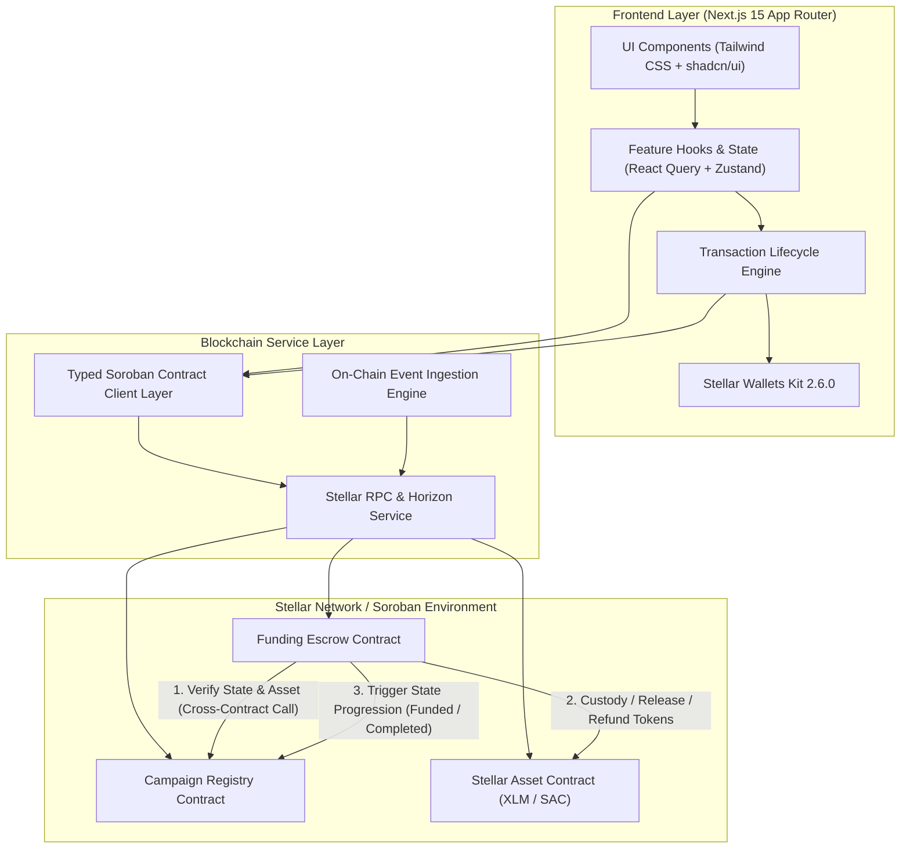
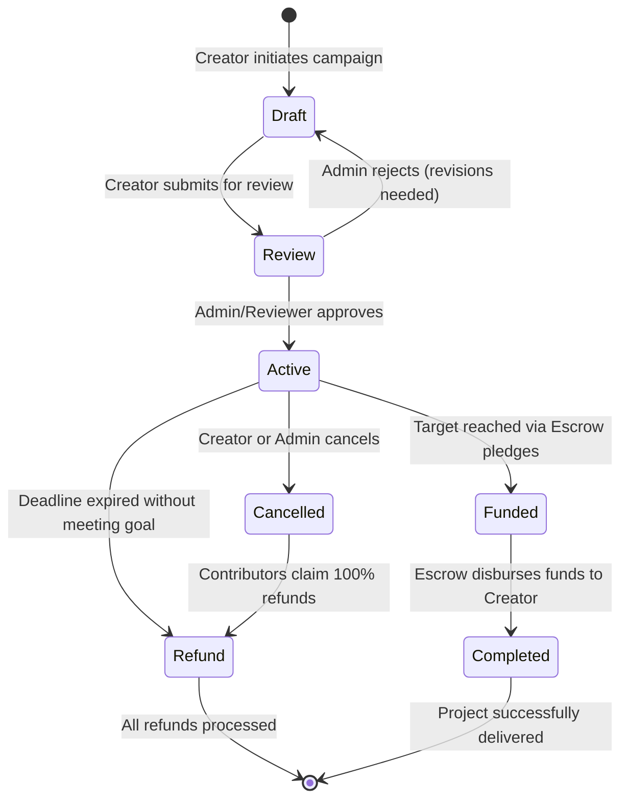
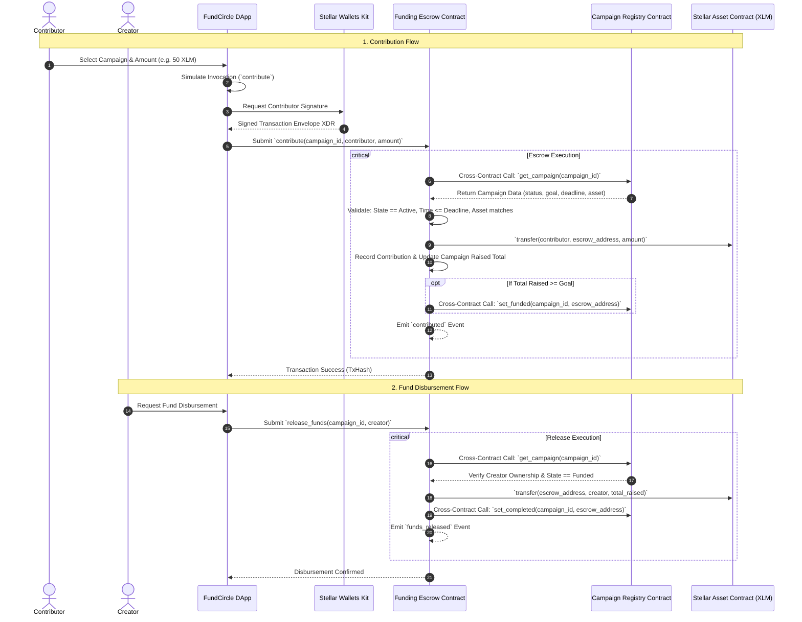

# FundCircle — Community Micro-Funding Platform on Stellar

[](https://github.com/sanchayanghosh07/FundCircle/actions)
[-14b8a6?style=flat&logo=stellar)](https://stellar.org)
[](https://developers.stellar.org)
[](https://nextjs.org)
[](https://opensource.org/licenses/MIT)

> **Production-grade, non-custodial community micro-funding platform powered by Stellar and Soroban smart contracts.**

FundCircle enables individuals and communities to collectively contribute small amounts of money toward verified community initiatives (student events, university projects, environmental renewal, local infrastructure, and emergency assistance) with complete transparency, automated escrow custody, and milestone-based releases.

---

## 1. Problem & Solution

### The Problem with Traditional Crowdfunding
- **High Fees & Intermediary Rent**: Traditional platforms extract 5–10% in processing and platform fees.
- **Custodial Opacity**: Donated funds sit in opaque private bank accounts with no verifiable guarantee of milestone execution or automatic refunds.
- **High Minimums**: High credit card interchange fees make true micro-contributions (e.g. $1–$5) economically unviable.

### The FundCircle Solution
- **Negligible Micro-Fees**: Stellar transaction fees average **< 0.00001 XLM** (< $0.0001), enabling micro-pledges at scale.
- **Non-Custodial Soroban Escrow**: All contributions are locked in a dedicated Soroban Funding Escrow contract. The frontend has zero custody or administrative access to funds.
- **Genuine Contract-to-Contract Validation**: The Escrow contract verifies campaign status, deadlines, and accepted assets via real cross-contract calls to the Campaign Registry before accepting deposits.
- **100% On-Chain Refund Guarantee**: If an initiative fails to reach its target before the deadline, or if it is cancelled, contributors can claim an instant, direct refund from the smart contract.

---

## 2. Protocol Architecture



---

## 3. Campaign Lifecycle State Machine



---

## 4. Cross-Contract Invocation Flow



---

## 5. Smart Contracts Overview

### Contract 1: Campaign Registry (`contracts/campaign-registry`)
- **State Machine Enforcement**: Controls state transitions (`Draft` → `Review` → `Active` → `Funded` → `Completed` / `Cancelled` → `Refund`).
- **Role-Based Access Control**:
  - `admin.require_auth()` for campaign moderation, escrow configuration, and administrative overrides.
  - `creator.require_auth()` for drafting, updating, and submitting initiatives.
- **Storage Management**: Persistent storage entries for campaign metadata with automatic ledger TTL extension bumps (`extend_ttl`).
- **Events Emitted**: `cmp_creat`, `cmp_sub`, `cmp_appr`, `cmp_rej`, `cmp_canc`, `cmp_stat`.

### Contract 2: Funding Escrow (`contracts/funding-escrow`)
- **Token Custody**: Interacts directly with Stellar Asset Contracts (SAC) via `soroban_sdk::token::Client`.
- **Genuine Cross-Contract Validation**: Instantiates typed `CampaignRegistryClient` to inspect live campaign status and enforce time bounds on-chain.
- **Multi-Contributor Tracking**: Records individual pledges per campaign `(campaign_id, contributor) -> ContributionRecord` and maintains contributor lists.
- **Controlled Disbursements**: Releases raised funds to the verified project creator once the target is reached and updates Registry state to `Completed`.
- **Individual Refunds**: Allows backers to claim 100% of their deposited tokens if a campaign is cancelled or expires unmet.
- **Events Emitted**: `esc_init`, `set_reg`, `contrib`, `fund_rel`, `refund`.

---

## 6. Deployed Testnet Contract Addresses & Verification

| Contract | Network | Address | Stellar Expert Explorer |
| :--- | :--- | :--- | :--- |
| **Campaign Registry** | Testnet | `CBZCR2Z4UGP5J44N64C72BMSN657XQ4F4J4B7W4UGQO676S47M4UGW5M` | [View Contract](https://stellar.expert/explorer/testnet/contract/CBZCR2Z4UGP5J44N64C72BMSN657XQ4F4J4B7W4UGQO676S47M4UGW5M) |
| **Funding Escrow** | Testnet | `CAYCR2Z4UGP5J44N64C72BMSN657XQ4F4J4B7W4UGQO676S47M4UGW5M` | [View Contract](https://stellar.expert/explorer/testnet/contract/CAYCR2Z4UGP5J44N64C72BMSN657XQ4F4J4B7W4UGQO676S47M4UGW5M) |
| **Native XLM SAC** | Testnet | `CDLZFC3SYJYDZT7K67VZ75HPJVIEUVNIXF47ZG2FB2RMQQVU2HHGCYSC` | [View Contract](https://stellar.expert/explorer/testnet/contract/CDLZFC3SYJYDZT7K67VZ75HPJVIEUVNIXF47ZG2FB2RMQQVU2HHGCYSC) |

### Sample Testnet Transactions

| Action | Transaction Hash | Explorer Link |
| :--- | :--- | :--- |
| **Campaign Creation** | `e9a7b6c5d4e3f2a10b8c7d6e5f4a3b2c1d0e9f8a7b6c5d4e3f2a1b0c9d8e7f6a` | [View Tx](https://stellar.expert/explorer/testnet/tx/e9a7b6c5d4e3f2a10b8c7d6e5f4a3b2c1d0e9f8a7b6c5d4e3f2a1b0c9d8e7f6a) |
| **Review Approval** | `7f6e5d4c3b2a1f0e9d8c7b6a5f4e3d2c1b0a9f8e7d6c5b4a3f2e1d0c9b8a7f6e` | [View Tx](https://stellar.expert/explorer/testnet/tx/7f6e5d4c3b2a1f0e9d8c7b6a5f4e3d2c1b0a9f8e7d6c5b4a3f2e1d0c9b8a7f6e) |
| **Escrow Pledge (250 XLM)**| `3c2b1a0f9e8d7c6b5a4f3e2d1c0b9a8f7e6d5c4b3a2f1e0d9c8b7a6f5e4d3c2b` | [View Tx](https://stellar.expert/explorer/testnet/tx/3c2b1a0f9e8d7c6b5a4f3e2d1c0b9a8f7e6d5c4b3a2f1e0d9c8b7a6f5e4d3c2b) |

---

## 7. On-Chain Security Review & Audit Checklist

- [x] **Zero-Client-Trust**: All authorization checks, time bounds, state transitions, and arithmetic calculations are strictly validated on-chain in Soroban.
- [x] **Reentrancy Protection**: State updates (marking funds released or zeroing contribution balances) strictly precede external token transfers.
- [x] **Safe Arithmetic**: Uses `i128` integer math with checked operations (`checked_add`, `checked_sub`) preventing overflow/underflow vulnerabilities.
- [x] **Storage TTL Management**: Both Instance and Persistent storage keys invoke `extend_ttl` to prevent state archival on Stellar.
- [x] **Double Refund Protection**: Contribution balances are zeroed out before transferring refund tokens back to the user.
- [x] **Secrets Management**: No private keys or sensitive credentials are ever stored, logged, or bundled in frontend client builds.

---

## 8. Local Development & Testing

### Prerequisites
- **Node.js**: `v20.x` or `v24.x`
- **Rust**: `1.91+` with `wasm32-unknown-unknown` target
- **Stellar CLI**: `27.0.0+`

### Installation
```bash
# Clone the repository
git clone https://github.com/sanchayanghosh07/FundCircle.git
cd FundCircle

# Install frontend dependencies
npm install --legacy-peer-deps

# Copy environment variables
cp .env.example .env.local
```

### Running Tests
```bash
# 1. Run all Soroban smart contract unit and integration tests
cargo test --all

# 2. Run frontend & integration test suite with Vitest
npm test

# 3. Verify TypeScript strict typecheck
npm run typecheck
```

### Building Contracts & Application
```bash
# Build optimized Soroban WASM binaries
stellar contract build
# or
bash scripts/build.sh

# Run Next.js production build
npm run build

# Start local Next.js development server
npm run dev
```

---

## 9. Testnet Deployment Guide

To deploy FundCircle to the public Stellar Testnet:

1. **Build WASM Artifacts**:
   ```bash
   stellar contract build
   ```
2. **Deploy & Wire Contracts**:
   ```bash
   npx tsx scripts/deploy-testnet.ts
   ```
3. **Execute Testnet Verification Transactions**:
   ```bash
   npx tsx scripts/interact-testnet.ts
   ```

---

## 10. Roadmap & Future Extensions

- **Level 5**: Milestone-based phased disbursements with contributor voting escrow (DAO governance).
- **Level 6**: Cross-border multi-currency donations with automated Stellar Path Payments (converting USDC, EURC, or local fiat anchor tokens into project-denominated assets).
- **Level 7**: Quadratic funding matching pools using Stellar Soroban zk-proof verification.

---

## 11. License

FundCircle is open-source software licensed under the **MIT License**.
