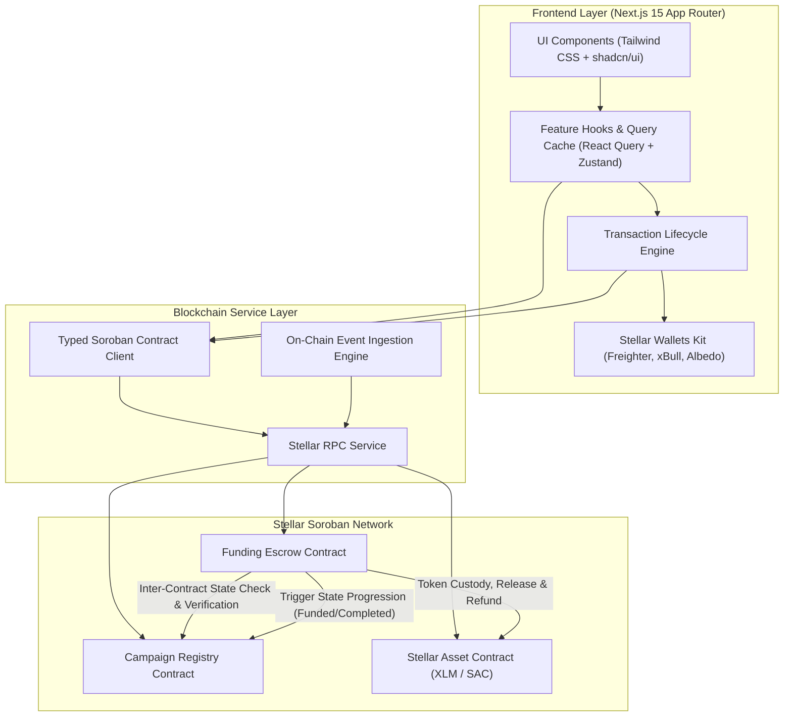
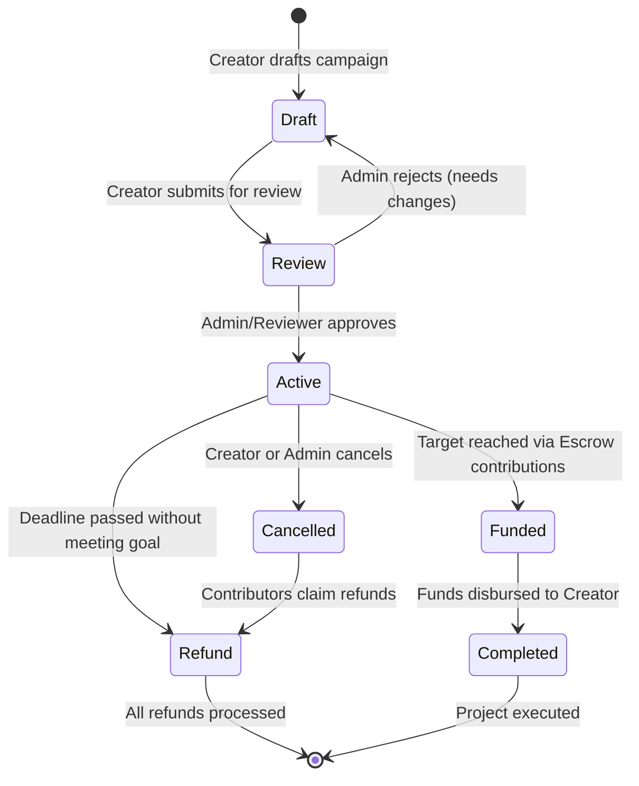
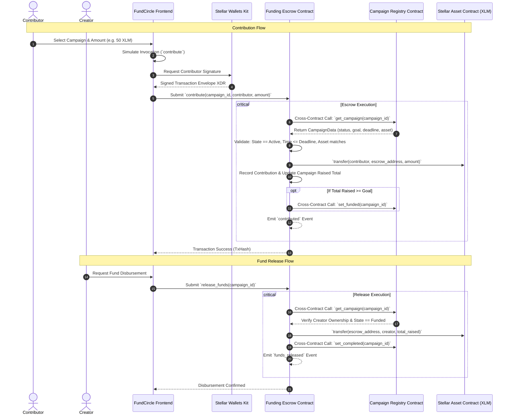

# FundCircle Architecture & Technical Design

FundCircle is a community-driven micro-funding protocol and decentralized application built natively on the Stellar blockchain with Soroban smart contracts.

## 1. System Architecture

## 2. Campaign Lifecycle State Machine

## 3. Inter-Contract Call Flow: Contribution & Fund Release

## 4. Contract Storage Strategy

- **Instance Storage**: Contract configurations, administrative authority, linked contract addresses, global counters.
- **Persistent Storage**: Campaign records, contribution ledgers, and creator indexes with periodic TTL extensions to prevent archival.
- **Temporary Storage**: Non-critical transient simulation caches.

## 5. Security & Trust Boundaries

1. **Zero Client Trust**: All authorization checks, time bounds, state transitions, and arithmetic calculations are strictly enforced on-chain.
2. **Reentrancy Protection**: State updates precede external SAC token disbursements.
3. **Integer Safety**: Uses `i128` safe math preventing overflow/underflow.
4. **Secret Protection**: No private keys are ever stored, transmitted, or requested by the application.
