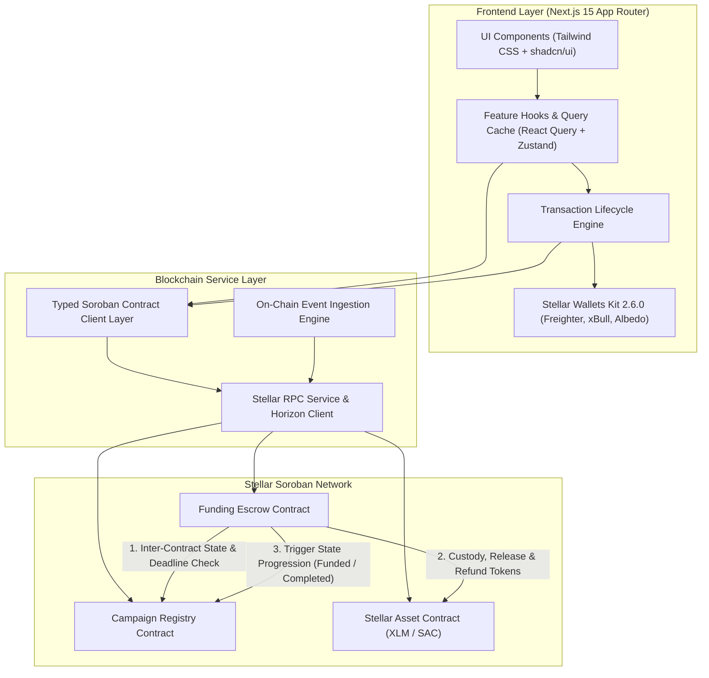
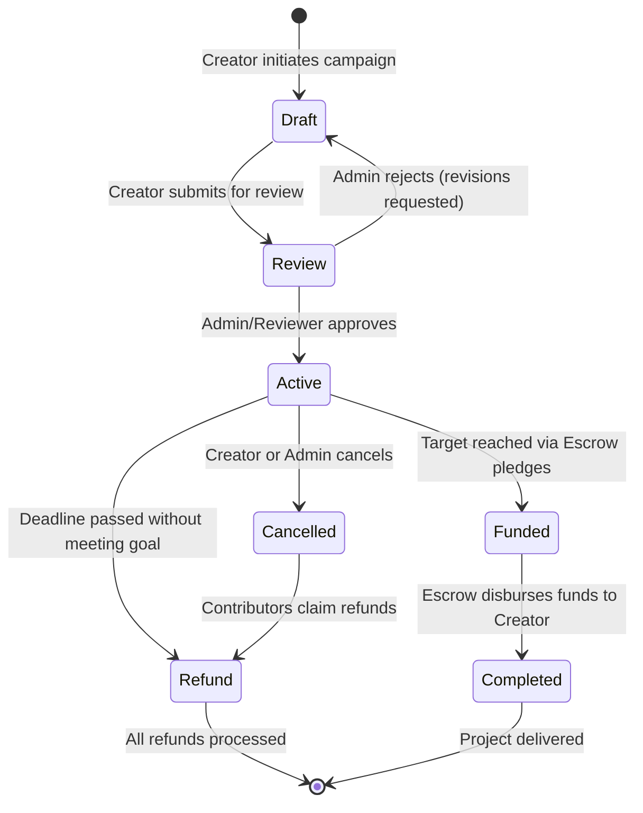
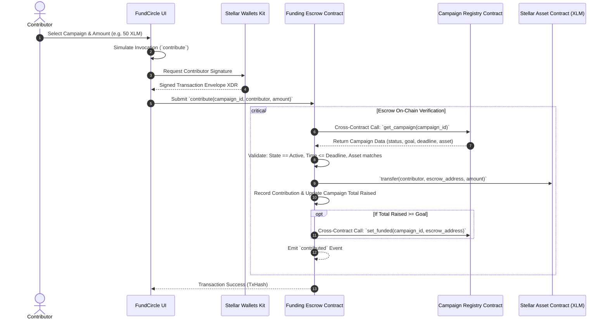
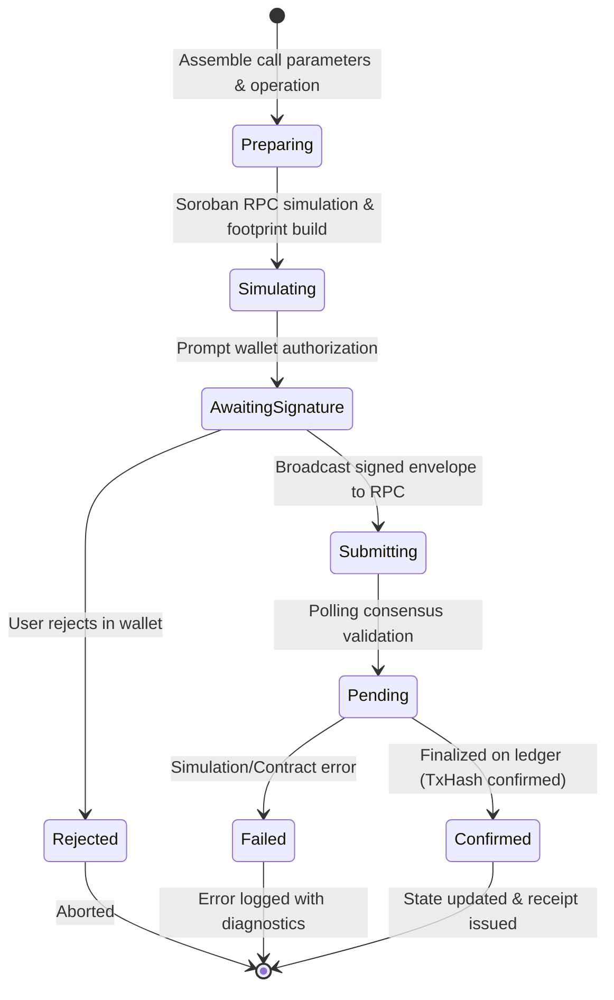

# FundCircle — Architecture & Technical Specifications (Level 4)

FundCircle is a community-driven micro-funding protocol and application built on the Stellar blockchain with Soroban smart contracts.

---

## 1. System Architecture



---

## 2. Campaign Lifecycle State Machine



---

## 3. Inter-Contract Call Flow: Contribution



---

## 4. Transaction Lifecycle Flow



---

## 5. Repository Structure

```text
FundCircle/
├── contracts/                        # Soroban Rust smart contracts
│   ├── campaign-registry/            # Contract 1: Campaign Registry
│   │   ├── Cargo.toml
│   │   └── src/
│   │       ├── lib.rs                # State machine, admin auth, storage
│   │       └── test.rs               # 7 unit tests (100% passing)
│   └── funding-escrow/               # Contract 2: Funding Escrow
│       ├── Cargo.toml
│       └── src/
│           ├── lib.rs                # Token custody, cross-contract calls
│           └── test.rs               # 6 integration tests (100% passing)
│
├── src/                              # Next.js 15 TypeScript application
│   ├── app/                          # App Router pages
│   │   ├── page.tsx                  # Landing page
│   │   ├── campaigns/page.tsx        # Campaign discovery & filters
│   │   ├── campaigns/[id]/page.tsx   # Campaign details & funding
│   │   ├── create/page.tsx           # Campaign creation wizard
│   │   ├── activity/page.tsx         # Live activity feed
│   │   ├── transactions/page.tsx     # Transaction center & history
│   │   ├── dashboard/creator/        # Creator dashboard
│   │   ├── dashboard/contributor/    # Contributor dashboard
│   │   ├── analytics/page.tsx        # Protocol analytics
│   │   ├── admin/page.tsx            # Reviewer & moderation queue
│   │   └── settings/page.tsx         # Network & contract settings
│   │
│   ├── features/                     # Domain feature modules
│   │   ├── campaigns/                # Campaign cards, filters, previews
│   │   ├── contributions/            # Contribution dialog & chip presets
│   │   └── transactions/             # Lifecycle modal & step indicators
│   │
│   ├── services/                     # Blockchain & Wallet service layer
│   │   ├── wallet/                   # Stellar Wallets Kit adapter
│   │   └── stellar/                  # RPC, Registry, Escrow & Event services
│   │
│   ├── stores/                       # Zustand state management
│   │   ├── walletStore.ts            # Wallet connection & balance
│   │   ├── transactionStore.ts       # Active tx state & persistent history
│   │   └── activityStore.ts          # Real-time activity cache
│   │
│   ├── components/                   # Reusable UI & Layout components
│   │   ├── ui/                       # Button, Card, Badge, Progress, etc.
│   │   ├── layout/                   # Navbar, NetworkBadge, Footer
│   │   └── providers/                # QueryClient & Toast providers
│   │
│   ├── config/                       # Network constants & contract addresses
│   ├── types/                        # TypeScript domain interfaces
│   └── test/                         # Frontend unit & integration tests
│
├── scripts/                          # Build & Deployment scripts
│   ├── build.sh                      # WASM compilation
│   ├── deploy-testnet.ts             # Testnet deployment & initialization
│   └── interact-testnet.ts           # Flow verification script
│
├── .github/workflows/ci.yml          # GitHub Actions CI/CD pipeline
├── Cargo.toml                        # Rust workspace configuration
├── package.json                      # Next.js dependencies & scripts
└── README.md                         # Production documentation
```

---

## 6. Smart Contract Specifications

### Campaign Registry Contract
- **Storage Keys**:
  - `Admin`: `()` → `Address`
  - `EscrowContract`: `()` → `Address`
  - `CampaignCount`: `()` → `u64`
  - `Campaign(u64)`: `u64` → `Campaign` *(Persistent storage with `extend_ttl`)*
  - `CreatorCampaigns(Address)`: `Address` → `Vec<u64>`
- **Errors**: `AlreadyInitialized`, `NotInitialized`, `Unauthorized`, `CampaignNotFound`, `InvalidStateTransition`, `InvalidGoalAmount`, `InvalidDeadline`, `InvalidMetadata`.
- **Events**: `reg_init`, `set_escr`, `set_adm`, `cmp_creat`, `cmp_sub`, `cmp_appr`, `cmp_rej`, `cmp_canc`, `cmp_stat`.

### Funding Escrow Contract
- **Storage Keys**:
  - `Admin`: `()` → `Address`
  - `RegistryContract`: `()` → `Address`
  - `CampaignTotal(u64)`: `u64` → `i128`
  - `Contribution(u64, Address)`: `(u64, Address)` → `ContributionRecord`
  - `Contributors(u64)`: `u64` → `Vec<Address>`
  - `ContributorCampaigns(Address)`: `Address` → `Vec<u64>`
  - `FundsReleased(u64)`: `u64` → `bool`
- **Errors**: `AlreadyInitialized`, `NotInitialized`, `Unauthorized`, `CampaignNotActive`, `CampaignExpired`, `AssetMismatch`, `InvalidAmount`, `GoalNotReached`, `FundsAlreadyReleased`, `NoContributionToRefund`, `CampaignNotEligibleForRefund`, `ArithmeticError`.
- **Events**: `esc_init`, `set_reg`, `contrib`, `fund_rel`, `refund`.
